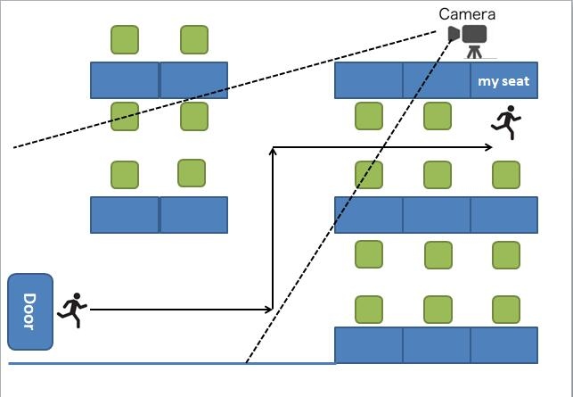
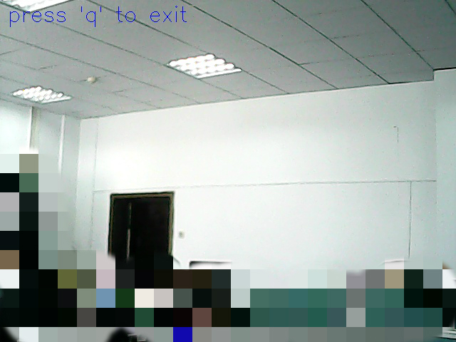

# BossRecognition
Real-time Boss Recognition and switch the desktop to the workspace.  

## Backgrounds   
After moving my seat to the corner of room, it's not easy for me to observer the situation in my lab. What if my boss is coming while I'm doing something else ? hahahaha, The BossRecognition system in on.

## Declaration 
这个小项目中用到的检测识别算法都来自于github上的开源项目，与实验室自己的人脸识别项目算法无关。  

All the face detection and face recognition algorithms used in this little project are from the open source community:github, which have none bussiness with my lab's face recognition projects.  

## Models  
FaceDetection Models: [MTCNN Models](https://github.com/kpzhang93/MTCNN_face_detection_alignment)  
FaceRecognition Model: [wy1iu/sphereface, SphereFace-20](https://github.com/wy1iu/sphereface)   

## Architecture   
1. **_init_paths.py**: add pycafffe to PYTHONPATH.  
2. **mtcnn.py**: MTCNN implemention in python code.  
3. **detectionAndAlign.py**: return all the aligned faces with an givenimage. 
4. **extractFeature.py**: extract the face feature with an aligned face image.  
5. **constructMean.py**: constrcut the meanfile according to meanvalue.  
6. **demo.py**: the full function for face detection, face alignment and face recognition
7. **cameraCapture.py**: capture the camera frame by an usb camera.
8. **processManage.py**: manage the process on linux via python os module.

## Usage  
Runtime environment: Ubuntu 16.04.3 LTS with GPU of Geforce GTX 1080Ti, Python 2.7.12    
**Requirements:**  
> 1. [BVLC/caffe && pycaffe](https://github.com/BVLC/caffe)   
> 2. GPU with CUDA support (CPU also works but slowly)   

**How to run this:**  
> 1. download the MTCNN models and shpereface models to the model and caffemodel directories.
> 2. set your own caffe path in **_init_paths.py**   
> 3. add some pictures of the one you want to recognize to the images folder   
> 4. cd BossRecognition  
> 5. python demo.py

## Reference Codes  
1. [happynear/MTCNN_face_detection_alignment](https://github.com/happynear/MTCNN_face_detection_alignment)  
2. MTCNN with Python code: [DuinoDu/mtcnn](https://github.com/DuinoDu/mtcnn)     

## Recognition Results    
0. sketch map  

1. monitor the room using an usb camera  
    

2. when someone is coming   
   

3. close some programs and open a full screen picture  
